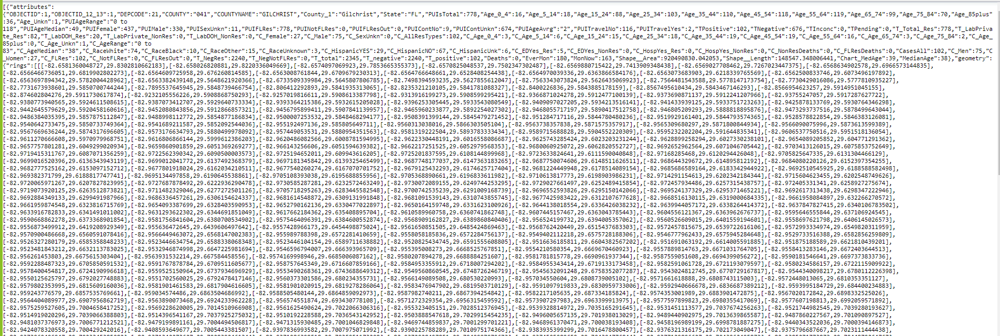
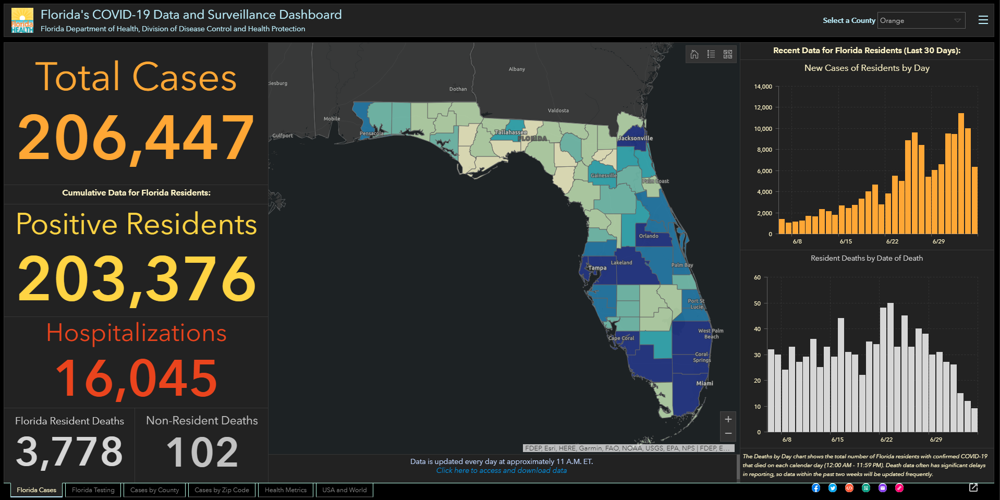
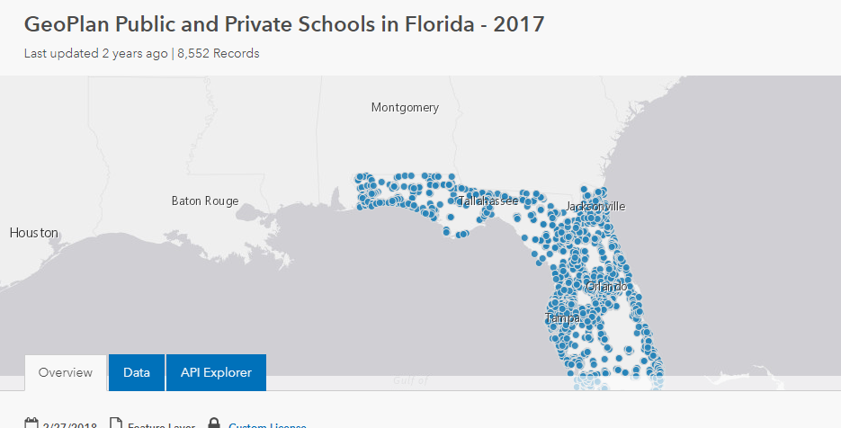
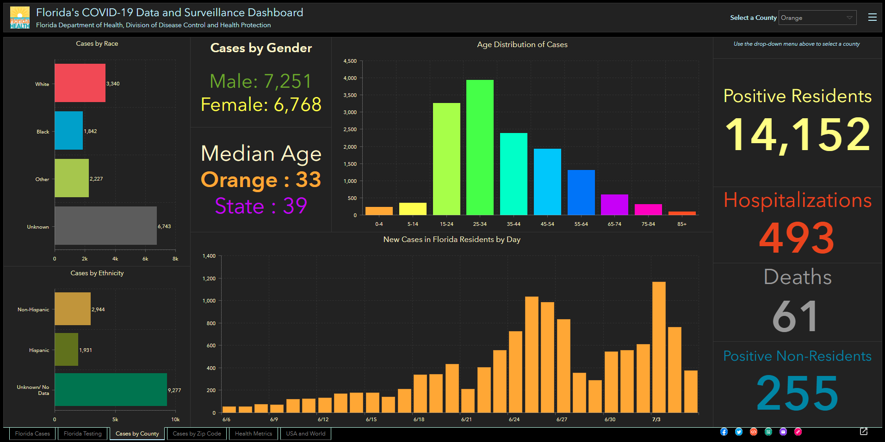
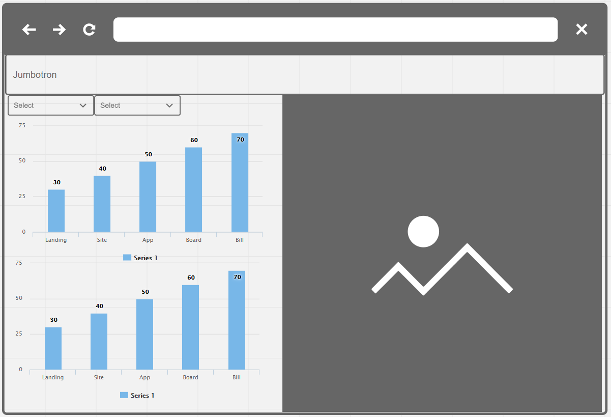

<H1>UCF Data Vizualization - Project 2</H1>

<H2>Project Title:</H2>

COVID-19 cases impact on opening up schools in <b>Florida</b>.

 
<H2>Team Members:</H2>
	
Christina Rawls, Dinh Duong, Joe Dahruj and Juan Salicrup

 
<H2>Project Description/Outline:</H2>
	
Using the skills and tools learnt in our Data Analytics/Vizualization course work such as SQL, Extract Transform Load (ETL), Data-Driven Documents (D3), Mapbox, Plotly, various frameworks and libraries we will explore ways to collect datasets and store them into a Postgres database. We will write APIs we can use in Python Flask. The data will get displayed using Plotly, Mapbox and Bootstrap. The chosen datasets we will are:

	<ul>
		<li><a href="https://usafacts.org/visualizations/coronavirus-covid-19-spread-map/" target="_blank">Coronavirus Locations: COVID-19 Map by County and State</a></li>
		<li><a href="https://floridahealthcovid19.gov/" target="_blank">Florida Heath COVID-19</a></li>
		<li><a href="https://geodata.myflorida.com/datasets/ufl::geoplan-public-and-private-schools-in-florida-2017" target="_blank">GeoPlan Public and Private Schools in Florida - 2017</a></li>
	</ul>		
	
     
<H2>Brief articulation:</H2>
	
Use public accessible datasets to visually assess the impact of COVID-19 on local schools in the state of Florida.

	
The focus question wil be: is it safe for schools to open in a particular county? We shall break down information gathered from our datasets into the following:

	<ul>
		<li>Number of infected versus hospitalization</li>
		<li>ICU bed availability per county</li>
		<li>Choosen criteria: if more than 20 under the age of 20 die then we cannot open</li>
		<li>Look at the number of cases versus population to see if this will give insight on schools to re-open</li>
	</ul>

 
<H2>Proposed specification:</H2>
	
We will perform ETL technique to take our chosen datasets and load them into a Postgres database. Database queries will be created and get served by our Python Flask application with end points that will be constructed to be used by our front end application.

	
The front end application will be built using D3, Plotly and Boxmap. We will have a dashboard display two types of charts and a Boxmap. The dashboard will be written in Bootstrap.

	
 
<H2>References:<H2>
	
## Meta Data of cases by county

	
	
## "Inspiring" Screenshot 1

	
	
## "Inspiring" Screenshot 2

	
	
## "Inspiring" Screenshot 3

	
	
## Dashboard Sketch/Design

